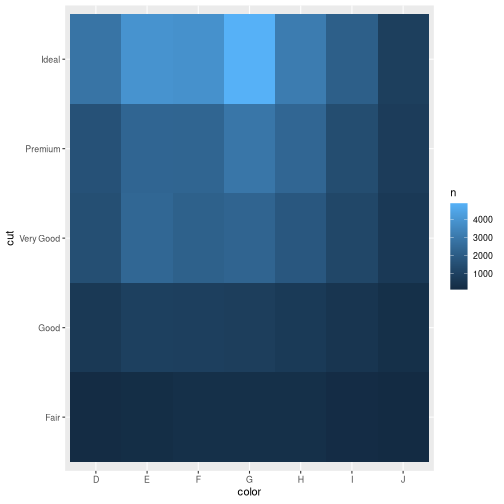
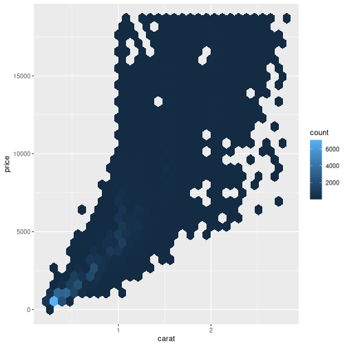

## Exploratory Data Analysis

-   Generate questions about your data.
-   Search for answers by visualizing, transforming, and modelling your data.

Use what you learn to refine your questions and/or generate new questions.


```r
library(tidyverse)
```

### Variation

-   What type of variation occurs within my variables?
-   What type of covariation occurs between my variables?


```r
ggplot(diamonds, aes(carat)) +
  geom_histogram(binwidth = 0.5)
```


#### Typical Values

-   Which values are the most common? Why?
-   Which values are rare? Why? Does that match your expectations?
-   Can you see any unusual patterns? What might explain them?


```r
smaller <- diamonds |> 
  filter(carat < 3)

ggplot(smaller, aes(carat)) +
  geom_histogram(binwidth = 0.01)
```


-   Why are there more diamonds at whole carats and common fractions of carats?
-   Why are there more diamonds slightly to the right of each peak than there are slightly to the left of each peak?

Visualizations can also reveal clusters, which suggest that subgroups exist in your data. To understand the subgroups, ask:

-   How are the observations within each subgroup similar to each other?

-   How are the observations in separate clusters different from each other?

-   How can you explain or describe the clusters?

-   Why might the appearance of clusters be misleading?

#### Unusual values

Outliers


```r
diamonds |> 
  ggplot(aes(y)) +
  geom_histogram(binwidth = 0.5)
```


The large range of the x-axis shows that there are outliers.

Change the y-coordinates to magnify the outliers.


```r
diamonds |> 
  ggplot(aes(y)) +
  geom_histogram(binwidth = 0.5) +
  coord_cartesian(ylim = c(0,50))
```


```r
unusual <- diamonds |> 
  filter(y < 3 | y > 20) |> 
  select(price, x, y, z) |> 
  arrange(y)
unusual
```

```
## # A tibble: 9 × 4
##   price     x     y     z
##   <int> <dbl> <dbl> <dbl>
## 1  5139  0      0    0   
## 2  6381  0      0    0   
## 3 12800  0      0    0   
## 4 15686  0      0    0   
## 5 18034  0      0    0   
## 6  2130  0      0    0   
## 7  2130  0      0    0   
## 8  2075  5.15  31.8  5.12
## 9 12210  8.09  58.9  8.06
```

Drop the rows?


```r
diamonds2 <- diamonds |> 
  filter(between(y, 3, 20))
```

Replace with NA!


```r
diamonds2 <- diamonds |> 
  mutate(y = if_else(y < 3 | y > 20, NA, y))
```


```r
ggplot(diamonds2, aes(x, y)) +
  geom_point(na.rm = TRUE)
```


```r
nycflights13::flights |> 
  mutate(
    cancelled = is.na(dep_time),
    sched_hour = sched_dep_time %/% 100,
    sched_min = sched_dep_time %% 100,
    sched_dep_time = sched_hour + (sched_min / 60)
  ) |> 
  ggplot(aes(sched_dep_time)) +
  geom_freqpoly(aes(color = cancelled), binwidth = 1/4)
```


### Covariation


```r
ggplot(diamonds, aes(price)) +
  geom_freqpoly(aes(color = cut), 
                binwidth = 500,
                linewidth = 0.75)
```


```r
ggplot(diamonds, aes(price, after_stat(density))) +
  geom_freqpoly(aes(color = cut), 
                binwidth = 500,
                linewidth = 0.75)
```


Note that we’re mapping the density to `y`, but since `density` is not a variable in the `diamonds` dataset, we need to first calculate it. We use the [`after_stat()`](https://ggplot2.tidyverse.org/reference/aes_eval.html) function to do so.

There’s something rather surprising about this plot - it appears that fair diamonds (the lowest quality) have the highest average price! But maybe that’s because frequency polygons are a little hard to interpret - there’s a lot going on in this plot.


```r
ggplot(diamonds, aes(cut, price)) +
  geom_boxplot()
```


Better diamonds are cheaper!


```r
ggplot(mpg, aes(class, hwy)) +
  geom_boxplot()
```


```r
ggplot(mpg, aes(fct_reorder(class, hwy, median), y = hwy)) +
  geom_boxplot()
```


Or flip horizontally.


```r
ggplot(mpg, aes(hwy, fct_reorder(class, hwy, median))) +
  geom_boxplot()
```


#### Two categorical variables

Size represents the number of occurrences


```r
ggplot(diamonds, aes(cut, color)) +
  geom_count()
```


```r
diamonds |> 
  count(color, cut)
```

```
## # A tibble: 35 × 3
##    color cut           n
##    <ord> <ord>     <int>
##  1 D     Fair        163
##  2 D     Good        662
##  3 D     Very Good  1513
##  4 D     Premium    1603
##  5 D     Ideal      2834
##  6 E     Fair        224
##  7 E     Good        933
##  8 E     Very Good  2400
##  9 E     Premium    2337
## 10 E     Ideal      3903
## # ℹ 25 more rows
```


```r
diamonds |> 
  count(color, cut) |> 
  ggplot(aes(color, cut)) +
  geom_tile(aes(fill = n))
```



#### Two numeric variables


```r
smaller |> 
  ggplot(aes(carat, price)) +
  geom_point()
```


```r
smaller |> 
  ggplot(aes(carat, price)) +
  geom_point(alpha = 1 / 100)
```


[`geom_bin2d()`](https://ggplot2.tidyverse.org/reference/geom_bin_2d.html) and [`geom_hex()`](https://ggplot2.tidyverse.org/reference/geom_hex.html) divide the coordinate plane into 2d bins and then use a fill color to display how many points fall into each bin. [`geom_bin2d()`](https://ggplot2.tidyverse.org/reference/geom_bin_2d.html) creates rectangular bins. [`geom_hex()`](https://ggplot2.tidyverse.org/reference/geom_hex.html) creates hexagonal bins. You will need to install the hexbin package to use [`geom_hex()`](https://ggplot2.tidyverse.org/reference/geom_hex.html).


```r
smaller |> 
  ggplot(aes(carat, price)) +
  geom_bin2d()
```


```r
smaller |> 
  ggplot(aes(carat, price)) +
  geom_hex()
```



Another option is to **bin one continuous variable** so it acts like a categorical variable. Then you can use one of the techniques for visualizing the combination of a categorical and a continuous variable that you learned about. For example, you could bin `carat` and then for each group, display a boxplot:


```r
ggplot(smaller, aes(carat, price)) +
  geom_boxplot(aes(group = cut_width(carat, 0.1)))
```


```r
ggplot(smaller, aes(carat, price)) +
  geom_boxplot(aes(group = cut_width(carat, 0.1)), varwidth=TRUE)
```


### Patterns and models

-   Could this pattern be due to coincidence (i.e. random chance)?
-   How can you describe the relationship implied by the pattern?
-   How strong is the relationship implied by the pattern?
-   What other variables might affect the relationship?
-   Does the relationship change if you look at individual subgroups of the data?


```r
library(tidymodels)

diamonds3 <- diamonds |> 
  mutate(
    log_price = log(price),
    log_carat = log(carat)
  )

diamonds_fit <- linear_reg() |> 
  fit(log_price ~ log_carat, data = diamonds3)

diamonds_aug <- augment(diamonds_fit, new_data = diamonds3) |> 
  mutate(.resid = exp(.resid))

ggplot(diamonds_aug, aes(carat, .resid)) +
  geom_point()
```


Once you’ve removed the strong relationship between carat and price, you can see what you expect in the relationship between cut and price: relative to their size, better quality diamonds are more expensive.


```r
ggplot(diamonds_aug, aes(cut, .resid)) +
  geom_boxplot()
```


